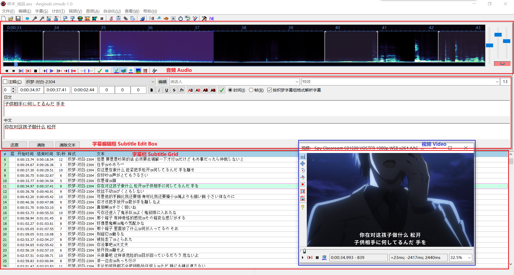
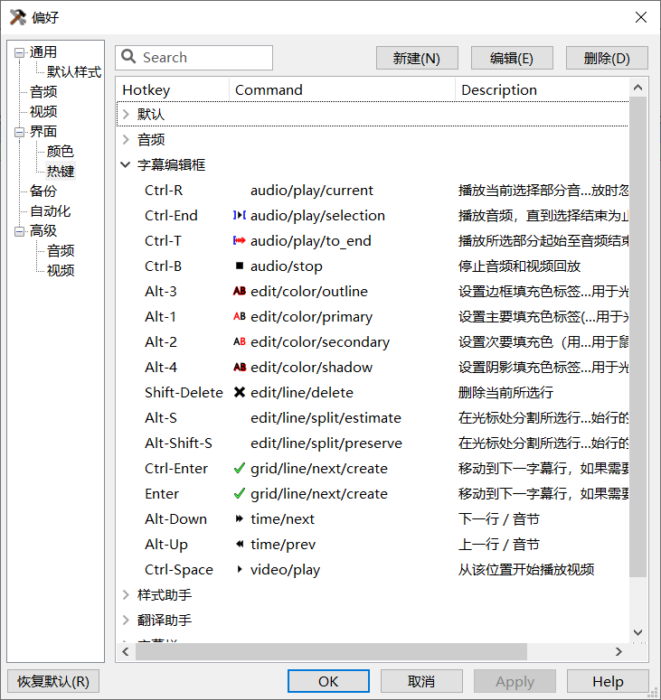

# Aegisub 织梦字幕组魔改版

本魔改版为我组自动化打轴计划的一环，为便于翻译君使用，对原版进行了魔改。

## 安装

在[Release](https://github.com/zhimengsub/Aegisub-zmsub/releases/latest)中下载`Aegisub-zmsub-xxx.zip`，解压后运行`Aegisub.exe`。

⚠️：仅支持Windows系统。

## 介绍

Aegisub是一款打轴工具，魔改版的界面如下：



主要魔改是把`显示原始字幕`的功能改为了`按织梦字幕组格式解析字幕`，勾选后会分别出现“日文”和“中文”两个文本框，可以分别编辑中文和日文部分，会自动用`\N`合在一起。

其他自带功能介绍如下：

- 编辑框上方三个时间分别为当前行的开始时间、结束时间、持续时间。

- 编辑框下方三个按钮：
  `还原`：可以恢复成修改之前的内容；
  `清除`：清空编辑框；
  `清除文本`：清楚编辑框中除特效标签（花括号包起来的部分）以外的其他内容。

- 视频框中的四个按钮：
  `从该位置开始播放视频`：从当前时间开始播放视频直到结束，再次点击可以暂停。
  `播放当前行`：从选中行开头开始播放视频，直到当前行结束。
  `停止视频回放`：暂停视频。
  `AUTO`：选中一行时，视频自动跳转到对应行开头。

[官方介绍](https://aegi.vmoe.info/docs/3.2/Editing_Subtitles/#section-4)

### 首次使用配置

1. 界面改为中文：
    `View` - `Language...` - `中文 (中国)` - `OK`

2. 剥离视频窗口(可选)
    `视频` - `拆分视频`
   可以把视频界面剥离出一个单独的窗口，避免拥挤。

3. [修改快捷键](#快捷键)(可选)


## 快捷键

`查看` - `选项` - `界面` - `热键`

快捷键设置页面包含多个分组，`默认`表示这个快捷键全局都可以使用，其他分组则表示焦点在这个区域时（鼠标点击了这个区域后）才能使用。



### 快捷键设置方法

1. 直接覆盖配置文件 (推荐)
   下载[Release](./releases/latest)中提供的`hotkey.json`，这是[我推荐的快捷键设置](#快捷键设置推荐)，将其放入`C:\Users\<你的用户名>\AppData\Roaming\Aegisub`覆盖即可。

2. 手动设置
    手动打开`查看` - `选项` - `界面` - `热键`，在对应分组内点击`新建`，然后在第一个框按下需要设置的快捷键，第二个框输入指令名，设置完后点击其他空白处即可确认。


### 快捷键设置推荐

为了提高翻译的效率，我推荐使用以下快捷键，可以根据自己习惯调整。
所有快捷键的指令可以[在这里](https://aegi.vmoe.info/docs/3.2/Commands/zh_CN/)查到。

#### 默认

在本分组的快捷键全局可用

| 新快捷键 | 默认快捷键  | Command  | 说明 | 备注 |
|---|---|---|---|---|
|PageUp|Ctrl-小键盘8|`grid/line/prev`| 移动到上一字幕行 |  |
|PageDown|Ctrl-小键盘2|`grid/line/next`| 移动到下一字幕行  |   |
|Alt-Left|无|`video/frame/prev/large`|视频进度条向前移动|默认仅在字幕栏和视频使用，改为全局后在打字时也可触发|
|Alt-Right|无|`video/frame/next/large`|视频进度条向后移动|默认仅在字幕栏和视频使用，改为全局后在打字时也可触发|
|Shift-Space|无|`video/play/line`|播放当前行|由于win10的bug，使用微软拼音输入法时会产生快捷键冲突，需要切换为英文输入法|
|F5|无|`video/play/line`|播放当前行|考虑到上述问题，再添加一个F键备用|
|Ctrl-Home|无|`video/play/line`|播放当前行|另一个备用快捷键|
|F4|Ctrl-P|`video/play`|播放/暂停视频|作为`字幕编辑框`分组中Ctrl-Space的备用快捷键|

#### 字幕编辑框

| 新快捷键 | 默认快捷键  | Command  | 说明 | 备注 |
|---|---|---|---|---|
|Ctrl-Space|无|`video/play`|播放/暂停视频|由于win10的bug，使用微软拼音输入法时会产生快捷键冲突，需要切换为英文输入法。可用F4作为备用|


#### 字幕栏

| 新快捷键 | 默认快捷键  | Command  | 说明 | 备注 |
|---|---|---|---|---|
|Space|无|`video/play`|播放/暂停视频|要在各个分组中分别设置，避免在字幕编辑时按空格触发|
|Ctrl-J|无|`edit/line/join/concatenate`|将所选行头尾相接，且中间用空格隔开||
|Alt-J|无|`automation/lua/zmsub.smart_join_lines_nospace/织梦.智能合并对话 (无分隔)`|所选行中文部分和日文部分各自头尾相接|脚本可以在`自动化`选项中手动执行|
|Alt-Shift-J|无|`automation/lua/zmsub.smart_join_lines_wspace/织梦.智能合并对话 (空格分隔)`|所选行中文部分和日文部分各自头尾相接，且中间用空格隔开|可根据自己实际使用频率跟上面的快捷键互换|

#### 视频

| 新快捷键 | 默认快捷键  | Command  | 说明 | 备注 |
|---|---|---|---|---|
|Space|无|`video/play`|播放/暂停视频|要在各个分组中分别设置，避免在字幕编辑时按空格触发|

另外，使用方向键左右或者滚轮可以逐帧调整视频。

#### 音频

| 新快捷键 | 默认快捷键  | Command  | 说明 | 备注 |
|---|---|---|---|---|
|Space|无|`video/play`|播放/暂停视频|要在各个分组中分别设置，避免在字幕编辑时按空格触发|

--- 

## 普通使用流程

1. 收到只含日文的`ass`台本文件，用本软件打开（或把ass拖入本软件）
2. 勾选`按织梦字幕组格式解析字幕`
3. 对每一行进行翻译。配合视频窗口和以下快捷键提高效率：
   - 双击一行对白，视频自动跳转到对应时间（如果开启`AUTO`按钮则单击对白）；
   - `播放当前行(Shift-Space / F5 / Ctrl-Home)`按钮确认视频内容；
   - `Alt-←`/`Alt-→`控制视频进度条；
   - `Ctrl-Space`(处于编辑栏)或`Space`(处于其他地方)控制播放/暂停视频；
   - `Shift-Space`播放当前行对应的视频；
   - `Alt-J`把两行的中文和日文部分分别合并在一起；
   - `Alt-Shift-J`把两行的中文和日文部分分别合并在一起，并用空格隔开；
   - `Ctrl-J`把两行头尾合并在一起（一般用不到），并用空格隔开；
 
⚠️：如果对日文部分有删改，请选中改行后在上方`说话人`处注明“日文有删改”，方便时轴调整时间。
4. 翻译完一行后，按`Enter`切换至下一行；或按`PageUp`/`PageDown`切换至上一行/下一行。


## 反馈

如果有一些使用上的意见和建议请提[Issue](./issues)

--- 

# 原版Readme

For binaries and general information see [the homepage](http://www.aegisub.org) and [release page](https://github.com/wangqr/Aegisub/releases).

The bug tracker can be found at https://github.com/wangqr/Aegisub/issues .

If you want to test the upstream version, r8942 [can be downloaded here](http://www.plorkyeran.com/aegisub/). If both r8942 and this fork have some common issue, report at [upstream](https://github.com/Aegisub/Aegisub/issues) may let more people see your issue, and I am also watching the upstream for issues. If it is a wangqr fork specific issue, report it here.

Support is available on IRC ( irc://irc.rizon.net/aegisub , for upstream version) or via issues.

## Building Aegisub

### autoconf / make (for linux and macOS)

This is the recommended way of building Aegisub on linux and macOS. Currently AviSynth+ support is not included in autoconf project. If you need AviSynth+ support, see CMake instructions below.

Aegisub has some required dependencies:
* `libass`
* `Boost`(with ICU support)
* `OpenGL`
* `libicu`
* `wxWidgets`
* `zlib`
* `fontconfig` (not needed on Windows)
* `luajit` (or `lua`)

and optional dependencies:
* `ALSA`
* `FFMS2`
* `FFTW`
* `Hunspell`
* `OpenAL`
* `uchardet`
* `AviSynth+`

You can use the package manager provided by your distro to install these dependencies. Package name varies by distro. Some useful references are:

* For ArchLinux, refer to [AUR](https://aur.archlinux.org/cgit/aur.git/tree/PKGBUILD?h=aegisub-git).
* For Ubuntu, refer to [Travis](.travis.yml#L14-L32).
* For macOS, see [Special notice for macOS](https://github.com/wangqr/Aegisub/wiki/Special-notice-for-macOS) on project Wiki.

After installing the dependencies, you can clone and build Aegisub with:
```sh
git clone https://github.com/wangqr/Aegisub.git
cd Aegisub
./autogen.sh
./configure
make
```

### CMake (for Windows, linux and macOS)

This fork also provides CMake build. Currently only x86 and x64 are supported due to limited support for building LuaJIT using CMake.

You still need to install the dependencies above. To enable AviSynth+ support, it is also needed. Installing dependencies on Windows can be tricky, as Windows doesn't have a good package manager. Refer to [the Wiki page](https://github.com/wangqr/Aegisub/wiki/Compile-guide-for-Windows-(CMake,-MSVC)) on how to get all dependencies on Windows.

After installing the dependencies, you can clone and build Aegisub with:

```sh
git clone https://github.com/wangqr/Aegisub.git
cd Aegisub
./build/version.sh .  # This will generate build/git_version.h
mkdir build-dir
cd build-dir
cmake ..  # Or use cmake-gui / ccmake
make
```

Features can be turned on/off in CMake by toggling the `WITH_*` switches.

For Archlinux users, you can also try the [PKGBUILD in project wiki](https://github.com/wangqr/Aegisub/wiki/PKGBUILD-for-Arch).

## Updating Moonscript

From within the Moonscript repository, run `bin/moon bin/splat.moon -l moonscript moonscript/ > bin/moonscript.lua`.
Open the newly created `bin/moonscript.lua`, and within it make the following changes:

1. Prepend the final line of the file, `package.preload["moonscript"]()`, with a `return`, producing `return package.preload["moonscript"]()`.
2. Within the function at `package.preload['moonscript.base']`, remove references to `moon_loader`, `insert_loader`, and `remove_loader`. This means removing their declarations, definitions, and entries in the returned table.
3. Within the function at `package.preload['moonscript']`, remove the line `_with_0.insert_loader()`.

The file is now ready for use, to be placed in `automation/include` within the Aegisub repo.

## License

All files in this repository are licensed under various GPL-compatible BSD-style licenses; see LICENCE and the individual source files for more information.
The official Windows build is GPLv2 due to including fftw3.
